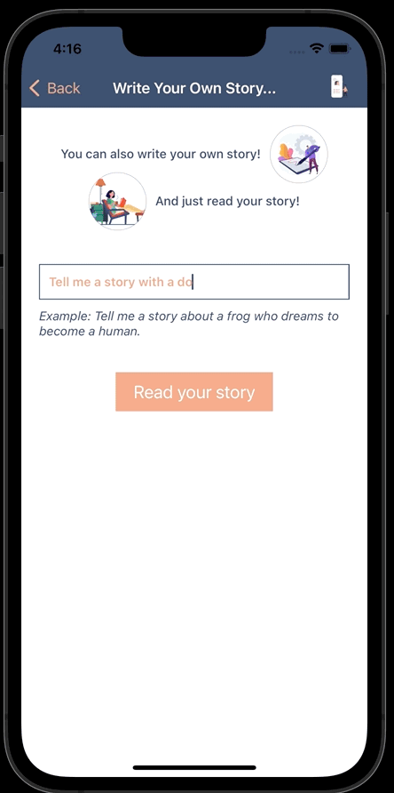
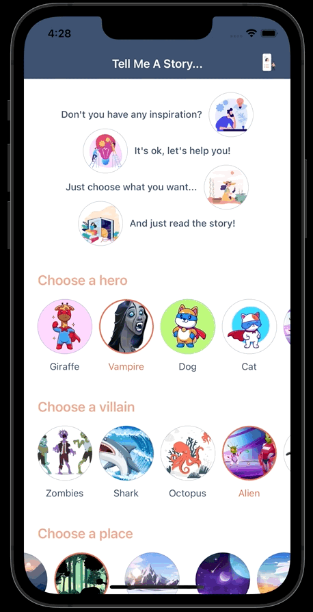

# Tell me a story...

## Introduction

I started this project mainly to play with [ChatGPT](https://chat.openai.com/) from [OpenAI](https://openai.com/). It's a small app that allows you to write a story using the [OpenAI API](https://platform.openai.com/docs/api-reference). There are some predefined stories to help your inspiration, and you can also write your own story.

This app uses these following API:

- [Create image](https://platform.openai.com/docs/api-reference/images/create)
- [Create completion](https://platform.openai.com/docs/api-reference/completions/create)

Enjoy it! :)

<br />

This app has four screens:

- A tutorial interface that introduces the app.
- A simple screen that displays the users who have created pictures and illustrations.
- The screen that allows you to write a predefined story.
- The screen that allows you to write your own story.


<br />



<br />


<br />

## Requirements

In order to use the API of ChatGPT, you have to create an account [Explore the OpenAI API](https://platform.openai.com/overview). After that, just create a new secret key [API keys](https://platform.openai.com/account/api-keys).

## Installation

```shell
$ git clone https://github.com/kiki-le-singe/tell-me-a-story-ai.git <name>
$ cd <name>
$ yarn | npm install
$ npx pod-install
```

> Create a .env file at the root of the project and set this env variable `OPENAI_API_KEY=<YOUR_SECRET_KEY>`

```shell
$ npm run ios
```

## Resources

All the images are taken from [Freepik](http://www.freepik.com). Those I have chosen have a free license. I just use them to illustrate this app.

They are designed by these authors:

<br />



<br />

- [freepik](https://www.freepik.com/author/freepik)
- [ddraw](https://www.freepik.com/author/ddraw)
- [vectorjuice](https://www.freepik.com/author/vectorjuice)
- [pikisuperstar](https://www.freepik.com/author/pikisuperstar)
- [pch.vector](https://www.freepik.com/author/pch-vector)
- [catalyststuff](https://www.freepik.com/author/catalyststuff)
- [rawpixel-com](https://www.freepik.com/author/rawpixel-com)
- [upklyak](https://www.freepik.com/author/upklyak)
- [brgfx](https://www.freepik.com/author/brgfx)
- [storyset](https://www.freepik.com/author/stories)

All the icons are taken from [unDraw](https://undraw.co/).

A big thanks to them for their awesome work!
